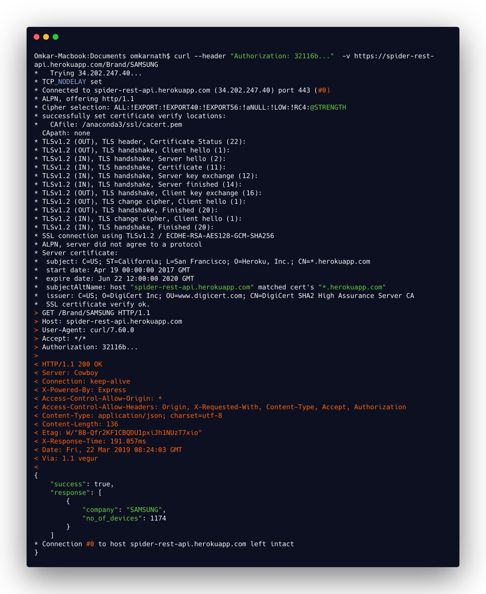

# Spider-REST-API

[](https://badge.fury.io/js/express)
[](http://doge.mit-license.org)

[](https://github.com/feross/standard)


<b>SPIDER is an open source REST API.</b> Under the hood when a user hit a request it throw data which is stored in database and also start fetching the latest and greatest gadgets information so, you will always stay updated about your favourate gadgets information. <br>
In the nutshell it uses _authentication_, _caching_, _encryption_ and _server crash reports_.
<br>

## Uses

- can be used a gadgets shopping website [Like This](https://github.com/omkarnath1123/My-Awesome-Shop)
- can used to create a gadgets comparision portal
- (ML application) recommend a user which device is best suited for you keeping some parameters in mind like screen resolution, processor, ram, os etc. { lib you might need [brain.js](https://github.com/BrainJS/brain.js) }
- (ML application) can be used to predict the specs and future of gadgets by keeping in mind that api is your training data set { lib you might need [brain.js](https://github.com/BrainJS/brain.js) [plotly.js](https://plot.ly/javascript/) }

## Server Structure
[](http://spider-rest-api.herokuapp.com/Brands)

The spider rest server uses _mongoDb_ as a database, _Redis_ as a caching server, _Express_ handles all the routes of the api, _Puppeteer_ used to get latest data and at last but not the least _Node_ which link all the above and adds functionality like token generation, authentication, token validation, routes validation, encryption etc.


## Client Site Rendering
[](https://spider-client.herokuapp.com/)

The spider uses client site rendring rendring and technology used are _Redux_ for state management, _GraphQl_ used for front end query language and also used in node to convert query GraphQL to mongoDb query and last but not the least _React_ which is used to create and handle all the UI in form of components.


<br/>

It takes :iphone: <b>Company/Companies</b> or <b>Device/Devices</b> and get latest subject data, update database and return a detailed description of that Company/Companies or Device/Devices.

Give it a try !! just follow these symple steps :hammer: -

> To setup and types of request please go to the [Wiki](https://github.com/omkarnath1123/Spider-REST-API/wiki) page.

## Test API
- proceed to client site of spider(as link mention above in Client Site Rendering) and as you are a new user click on sign up now.
- open page console `Ctrl Shift J` (on Windows) or `Ctrl Option J` (on Mac) and clear your console
- now fill your desired _USERNAME_, _EMAIL_ and _PASSWORD_ and click sign up.
- If you see something like this object in your console you have just created a user for api request. If not sign up again and select a new user name. Even after that you are still facing issues please raise a issue.
```
{
  message: "New user is created successfully"
  success: true
}
```
- To receive a token from the user you have just created fill your _USERNAME_ and _PASSWORD_ and if your user name and password is correct you will see this object in your console which will contain your token.
```
{
    "loggedIn": true,
    "token": "fc16aabb57febca9af7ee886cb7f8c7e6d4aa4a4eb63c720be6d3bada157063761f2709e13d0010920e088f0af16070b4515c4774adb07a6cfa4966cf8bd69c141c51f9c5e286764497e90c64e5033629d64f84ae73a170ceab62407985a2be7a78114ebcecf0742e3d711765c8ec53aea5c83c8eb27ee0dcf1964762103aae44a85"
}
```
> remember copy token string without this => *"*  
- copy your token from console and now finally we hit the api using *CURL* request.
- place your token in the curl request and your curl request should look like this :

``curl --header "Authorization: <YOUR TOKEN HERE> "  -v https://spider-rest-api.herokuapp.com/Brand/SAMSUNG``
- open your terminal and paste you curl request and hopefully you will see the response as no of gadgets of SAMSUNG released till this date. This DB is not updated regurarly so device count may be little less.
```
{
    "success": true,
    "response": [
        {
            "company": "SAMSUNG",
            "no_of_devices": 1174
        }
    ]
}
```

